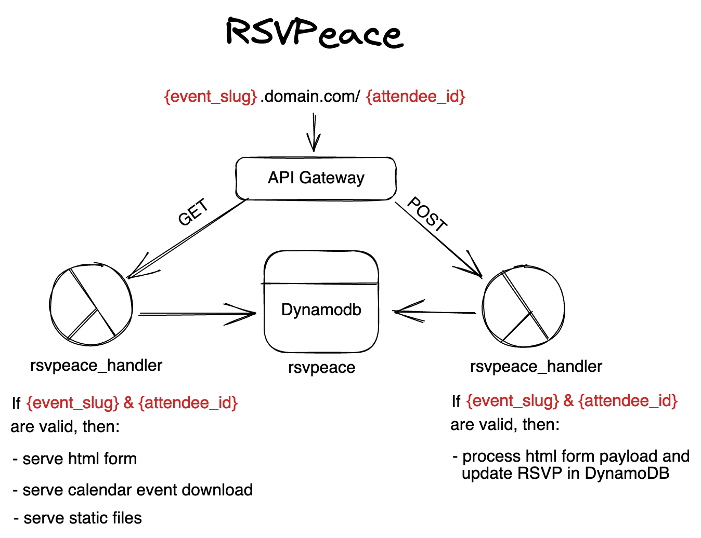

~~# RSVPeace

✌️ Serverless RSVP tool for simple events

This project allows you to collect RSVP data for any event that you can come up with. Invitees have their personal,
privacy-friendly, url where they can add and update their attendance. These urls are very easy to remember or print, and
follow the following pattern: `https://event_slug.yourdomain.com/ABC-DEF` (or any other attendee identifier you want to
use).

The project is using only serverless services of AWS, and can be visualized like below:



## Development

### Prerequisites

- tfswitch (`brew install warrensbox/tap/tfswitch`)
  - add `export PATH=$PATH:$HOME/bin` to the end of your `~/.zshrc`
- You need to own a domain name and need to have a hosted zone in AWS route53 for it

### Setup environment

The project is only using pure python + boto3, which is already baked into lambda functions. However, you'll get a
better development experience by installing the development requirements and installing the pre-commit hooks.

```zsh
pip install -r requirements-dev.txt
pre-commit install
```

### Deployment

```zsh
cd infra/terraform/prd
terraform init # only once, follow the prompts to enter s3 bucket and s3 key to store states in, and specify the AWS region
terraform plan -out=plan.tfplan -var "domain_name=example.com"
...
# happy with the plan? Apply it with:
terraform apply plan.tfplan
```

### Fill the database

This project is using a single table design in DynamoDB. It expects `event_slug` as partition key, and `details` as
sort_key. The table below describes how this looks like:

| event_slug | details         | the rest                                                      |
| ---------- | --------------- | ------------------------------------------------------------- |
| my_event   | event           | { ...all details about event}                                 |
| my_event   | attendee#abcdef | {...all details about an attendee, including the rsvp status} |
| my_event   | attendee#xyz123 | {...all details about an attendee, including the rsvp status} |

Sample records with all the required fields can be found in the `/docs` folder in this repo. You can add entries
manually
in the DynamoDB console, but if you have a csv file with the full_name and nickname of your invitees, you can use the
script
in `/scripts` to generate idempotent identifiers and create records for them in DynamoDB.

NOTE: the actual identifier creation is not included in the scripts. You can come up with your own. The sky is the
limit.

## Possible improvements:

- Working with dates and timezones and daylight savings is hard. All dates are currently in the Europe/Amsterdam
  timezone, and the calendar event generation is optimized for this zone too. Adding support for more timezones is
  possible, but non-trivial, and was not necessary for the initial version.
- API Gateway only supports https connections. This means that the event domain cannot be called with http://. This is a
  very reasonable default. However, some users might be helped with automatic upgrading of their connections from http
  to https. For this to work, one would need to change this project to use Cloudfront in combination with API Gateway.

## FAQ

**Why are you not hosting this on an s3 bucket with cloudfront, and using lambda authorizers etc?**

Because this was more fun to develop
